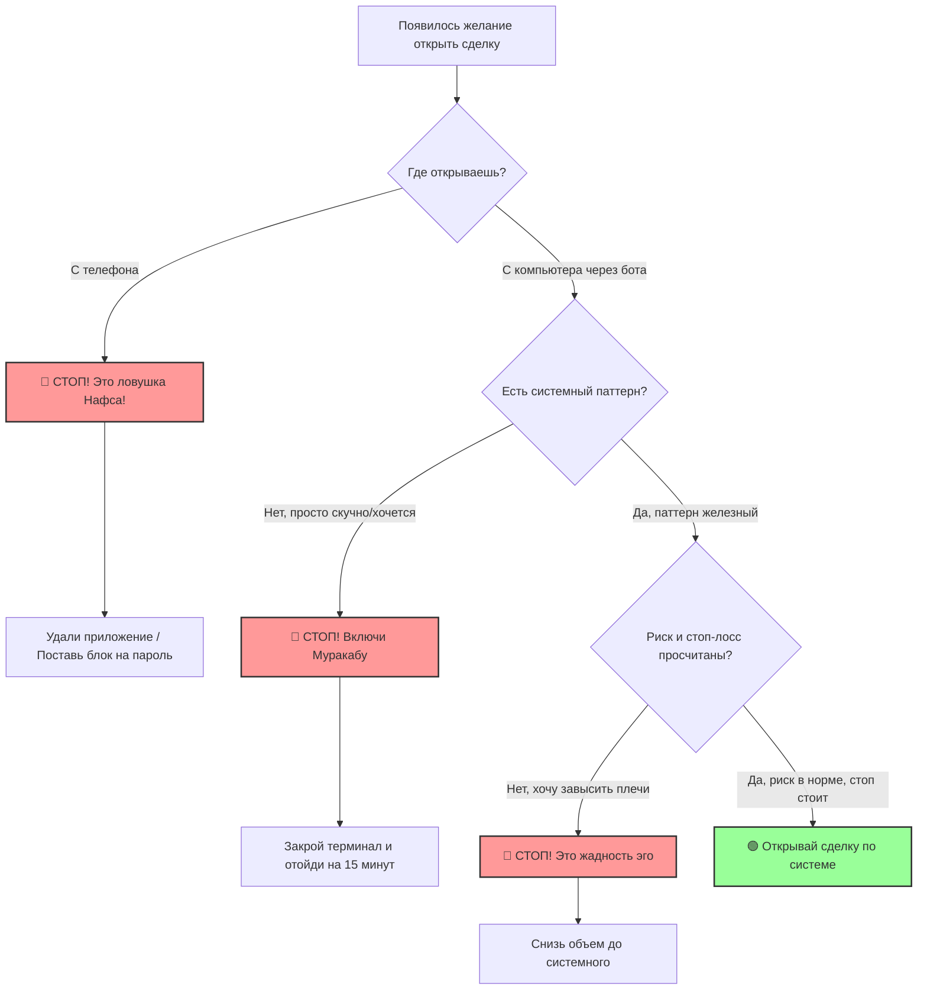
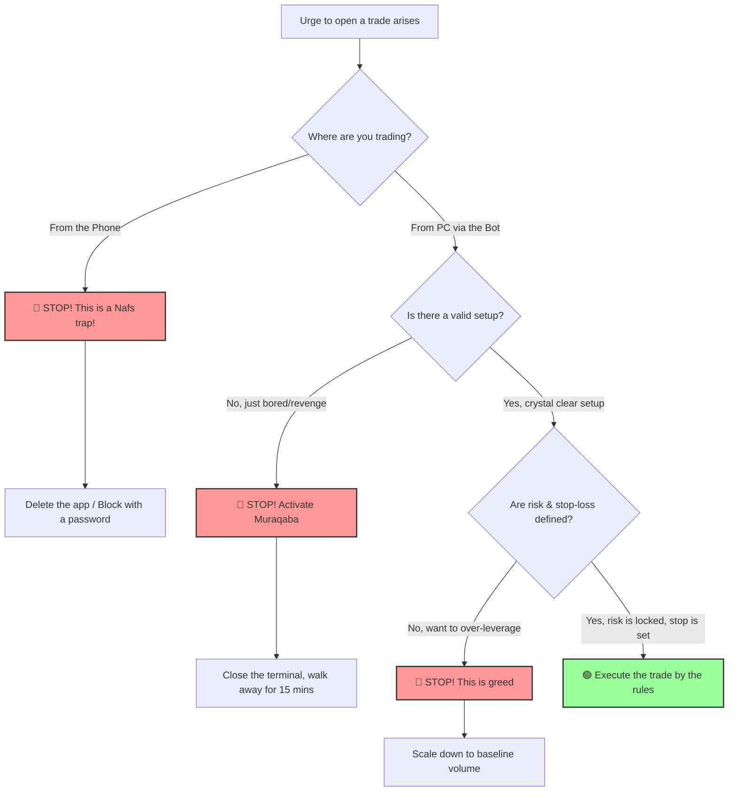

# 🕋 Суфийский Чек-лист Трейдера: Укрощение Нафса на Рынке

> "Самая жестокая война — это битва со своими собственными страстями (Нафсом)."
> — Имам аль-Газали

Этот манифест и чек-лист созданы для трейдеров, ведущих внутреннюю борьбу с тильтом, импульсивными входами, жадностью и гордыней. Рынок — это не графики. Рынок — это идеальное зеркало вашей души.

---

## 📊 Блок-схема процесса принятия решений

---

## 🛠 Ежедневный Чек-лист Самоконтроля

### 1. Мушарата (Утренний договор с эго) — Перед открытием терминала
* [ ] **Укрощение гордыни:** Я признаю, что я не умнее рынка. Я не умею предсказывать будущее. Моя задача — не быть правым, а следовать системе алгоритма.
* [ ] **Смирение перед риском:** Мой стоп-лосс определен *до* входа в сделку. Постановка стопа — это мое признание того, что рынок мне не подчиняется.
* [ ] **Связывание страсти:** Максимальный риск на день жестко зафиксирован (X%). Если я получу этот убыток, мой торговый день окончен без исключений.

### 2. Муракаба (Осознанность в моменте) — Перед нажатием кнопки
* [ ] **Анализ мотива:** Зачем я открываю эту позицию? Это системный паттерн или это FOMO, скука и желание «отыграться» после минуса?
* [ ] **Укрощение гнева:** Если предыдущая сделка закрылась в минус, я закрываю ноутбук на 15 минут. Я не имею права «мстить» рынку и переворачивать позицию в ярости.
* [ ] **Отречение от плеч:** Завышаю ли я лот или плечи прямо сейчас? Если да — это говорит моя жадность. Я снижаю объем до системного.

### 3. Мухасаба (Вечерний отчет) — После закрытия терминала
* [ ] **Оценка дисциплины, а не денег:** Был ли я успешен сегодня? Мой успех измеряется не профитом, а тем, сколько раз я победил свои эмоции.
* [ ] **Принятие результата (Таваккуль):** Если день закрыт в минус, но по правилам — я благодарен за этот урок смирения. 
* [ ] **Проверка обходных путей:** Пытался ли я сегодня обойти своего бота (через телефон, другой аккаунт или ручные настройки)?

---

## 🔨 Система наказаний за нарушение договора (Муакаба)

Нафс подобен дикому зверю: если запереть его в клетку на ПК (через торгового бота), он найдет лазейку в телефоне. За любое нарушение правил вы обязаны немедленно наказать свое эго тем, что оно ненавидит больше всего.

1. **💸 Финансовый штраф (Удар по жадности):**
   Вы переводите фиксированную сумму (например, 15% от суммы допущенного из-за тильта убытка) на благотворительность. Жадность нафса лечится только принудительным отнятием денег в пользу других.
2. **🔒 Торговый пост (Лишение дофамина):**
   Полный запрет на открытие торгового терминала на **3 рабочих дня** за стандартный тильт. За обход бота через телефон — **7 дней абсолютного запрета на трейдинг**.
3. **🔋 Физическая аскеза (Укрощение гордыни):**
   Выполнение тяжелой или неприятной работы по дому (генеральная уборка), 100 отжиманий сразу после срыва, либо отказ от сахара/кофе на следующие 48 часов.

---

## 🕯 Рекомендации по цифровой и ментальной гигиене

* **Правило закрытого черного хода:** Торговля с мобильного телефона запрещена навсегда. Нафс использует мобильность телефона, чтобы застать ваш разум врасплох в неподходящей обстановке. Удалите все торговые приложения со смартфона.
* **Принцип «Быть в рынке, но не от рынка»:** Отключите уведомления во всех трейдерских чатах и каналах. Мнения толпы разжигают FOMO и заставляют совершать импульсивные действия.
* **Тайная зона побед:** Если вы провели идеальный день по системе и заработали — не хвастайтесь этим. Оставьте эту победу между собой и Богом. Хвастовство подпитывает скрытую гордыню, которая приведет к сливу на следующий же день.

***
***

# 🕋 Sufi Trading Checklist: Purifying the Nafs in the Markets

> "The fiercest warfare is the battle against your own desires (Nafs)." 
> — Imam al-Ghazali

This manifesto and checklist are designed for traders engaged in an inner battle against tilt, revenge trading, greed, and pride. The market is not just charts; it is a perfect mirror reflecting the state of your soul.

---

## 📊 Decision-Making Flowchart

---

## 🛠 Daily Self-Control Checklist

### 1. Musharata (Morning Contract with Ego) — Before Opening the Terminal
* [ ] **Subduing Pride:** I admit that I am not smarter than the market. I cannot predict the future. My goal is not to be right, but to strictly follow my algorithmic system.
* [ ] **Humility in the Face of Risk:** My stop-loss is defined *before* entering the trade. Setting a stop is my active submission to the fact that I do not control the market.
* [ ] **Binding Desire:** My maximum daily risk is strictly locked (X%). If I hit this loss limit, my trading day is over, no exceptions.

### 2. Muraqaba (Mindfulness in the Moment) — Before Clicking the Button
* [ ] **Analyzing the Motive:** Why am I opening this position? Is it a valid system setup, or is it FOMO, boredom, and the urge to "win back" after a loss?
* [ ] **Quenching Anger:** If the previous trade closed in the red, I shut my laptop for 15 minutes. I have no right to seek "revenge" on the market or flip my position in fury.
* [ ] **Renouncing Leverage:** Am I scaling up my lot size or leverage right now? If yes, that is greed talking. I will scale back down to my baseline risk.

### 3. Muhasaba (Evening Self-Auditing) — After Closing the Terminal
* [ ] **Evaluating Discipline, Not Money:** Was I successful today? My success is measured not by profit, but by how many times I conquered my emotional impulses.
* [ ] **Acceptance of the Outcome (Tawakkul):** If the day ended in a loss but rules were strictly followed, I am grateful for this lesson in humility.
* [ ] **Checking the Backdoors:** Did I attempt to bypass my bot today (via phone, an alternative account, or manual overrides)?

---

## 🔨 The Penalty System for Rule Violations (Mu'aqaba)

The Nafs is like a wild beast: if you lock it in a cage on your PC (using a trading bot), it will dig a backdoor through your phone. For any violation of the rules, you must immediately punish your ego with what it hates most.

1. **💸 Financial Penalty (Crushing the Greed):**
   Transfer a fixed amount (e.g., 15% of the loss incurred during the tilt) to a charitable organization. The greed of the Nafs can only be cured by forcefully stripping it of wealth for the benefit of others.
2. **🔒 The Trading Fast (Depriving the Dopamine):**
   A strict ban on opening the trading terminal for **3 business days** for a standard tilt violation. For bypassing the bot via the phone—**7 days of an absolute trading ban**.
3. **🔋 Physical Asceticism (Subduing the Pride):**
   Engaging in hard or unpleasant physical labor (deep cleaning your living space), doing 100 push-ups immediately after a breakdown, or fasting from sugar/coffee for the next 48 hours.

---

## 🕯 Digital and Mental Hygiene Guidelines

* **The Closed Backdoor Rule:** Trading from a mobile phone is banned forever. The Nafs capitalizes on the phone's mobility to catch your intellect off-guard in unsuitable environments. Delete all trading applications from your smartphone.
* **The "In the Market, Not of the Market" Principle:** Mute all trading group chats and channels. The opinions of the crowd only fuel FOMO and trigger impulsive behaviour.
* **The Secret Zone of Victories:** If you have had a perfect trading day according to your system and made a profit—do not boast about it. Keep this victory strictly between yourself and God. Bragging feeds hidden pride, which will lead to a blown account the very next day.
